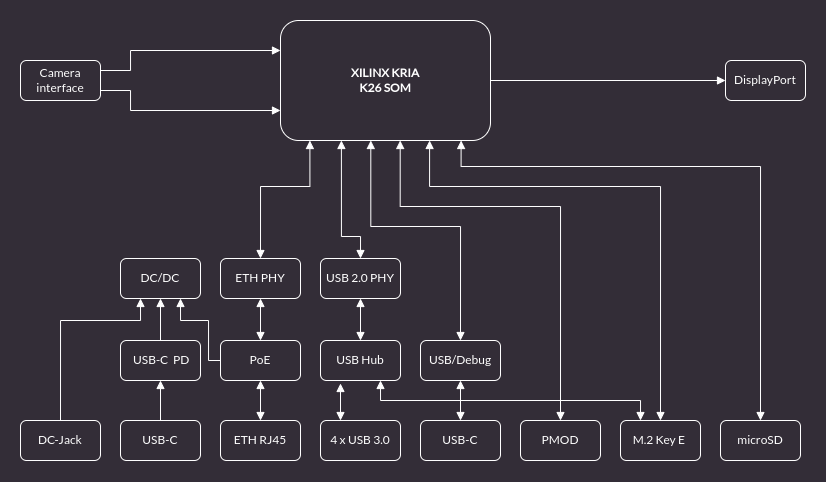

# Antmicro's open source Kria K26 Devboard

Copyright (c) 2022 [Antmicro](https://www.antmicro.com)

## Overview

This repository contains open hardware design files for a devkit created for Xilinx [Kria K26](https://www.xilinx.com/products/som/kria.html) System on Module (SoM).

This development board routes the I/O interfaces from the SoM and provides the necessary power buses.
The design files were prepared in KiCad 6.

## Repository structure

The main repository directory contains KiCad PCB project files, a [LICENSE](LICENSE), and a README.
The remaining files are stored in the following directories:

* `lib` - contains the KiCad 6 component libraries,
* `img` - contains graphics for this README,

## Key Features

* Xilinx Kria K26 SOM
* Gigabit Ethernet
* DisplayPort output
* 4x USB 3.2 Gen 1 connector
* USB Type-C connector for FTDI JTAG and debug
* M.2 connector (key E) for optional WiFi and Bluetooth connectivity
* 2x 4-lane MIPI CSI-2 camera interface
* PMOD
* SD 3.0 (MicroSD UHS-1)

The board supports multiple power supply scenarios, including:

* PoE (Power over Ethernet)
* USB-C PD (Power Delivery)
* External PSU via DC Jack

The on-board camera connector is electrically compatible with several video accessories created by Antmicro, such as:
 
* [OV9281 Dual Camera Board](https://github.com/antmicro/ov9281-camera-board)
* [SDI-MIPI bridge](https://github.com/antmicro/sdi-mipi-bridge)
* [HDMI-MIPI bridge](https://github.com/antmicro/hdmi-mipi-bridge)

## Board diagram

## License

[Apache-2.0](LICENSE)
